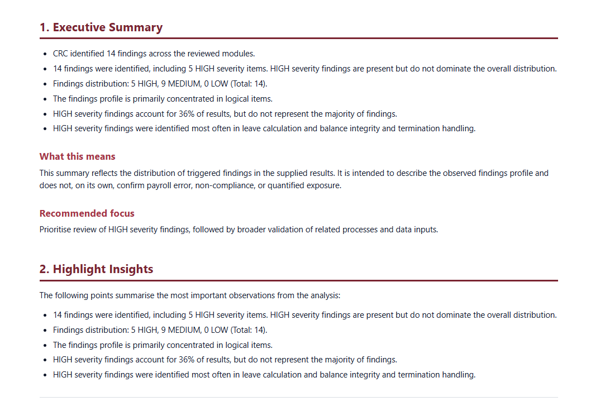
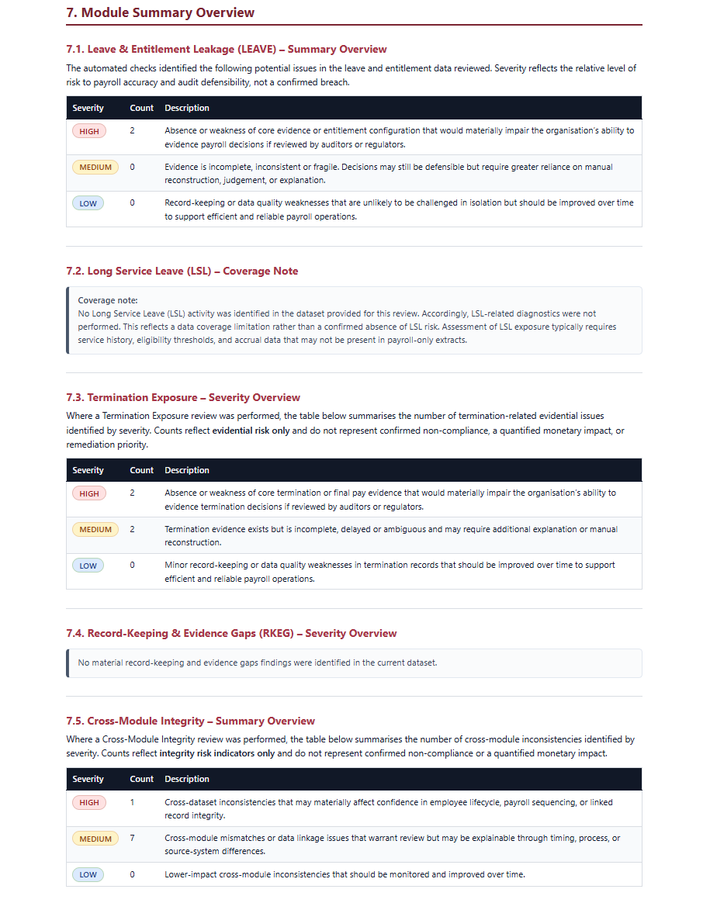
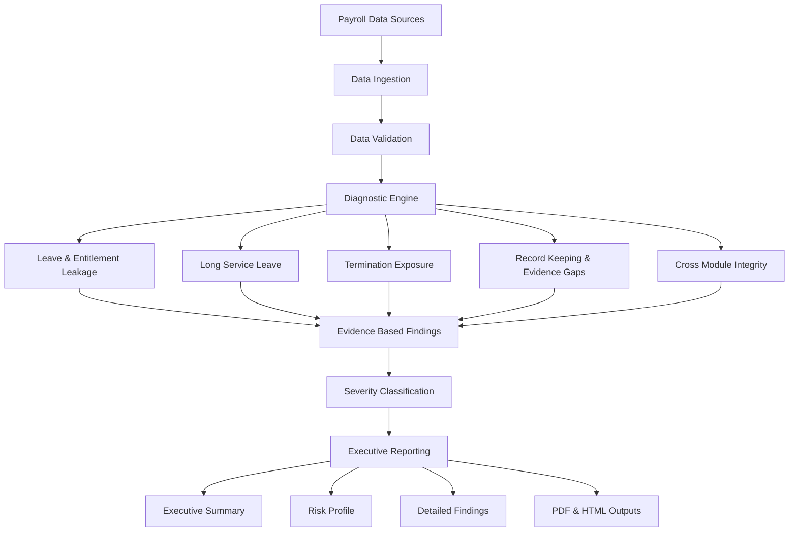

# Chase Risk & Compliance (CRC)

A modular payroll diagnostics and governance platform designed to identify hidden risks, operational inconsistencies, data quality issues, and compliance exposures through structured rule-based analysis.

CRC was built to demonstrate how operational intelligence systems can move beyond transaction processing and reporting to proactively surface risks, evidence gaps, and governance concerns.

---

# The Problem

Most payroll and operational systems are designed to process transactions, calculate outcomes, and generate reports.

However, they typically do not identify:

- Hidden compliance risks
- Operational inconsistencies
- Data quality issues
- Record keeping deficiencies
- Cross-process integrity failures
- Governance weaknesses
- Emerging risk trends

As a result, issues often remain undetected until audits, employee disputes, compliance reviews, acquisitions, or regulatory investigations occur.

---

# The Solution

CRC is a modular diagnostics engine that ingests payroll and operational data, applies domain-specific rule analysis, and generates structured findings supported by traceable evidence.

The platform focuses on:

- Risk detection
- Governance visibility
- Operational assurance
- Data quality assessment
- Explainable findings
- Executive-level reporting

Rather than replacing existing payroll systems, CRC acts as an independent diagnostics layer that continuously analyses operational data for risks and anomalies.

---

# Example Outputs

## Executive Summary

The platform generates executive-ready reporting designed to provide rapid visibility of key risk areas, severity distribution, and recommended review priorities.



---

## Module Risk Analysis

CRC analyses multiple payroll governance domains independently and provides risk summaries for each module.



---

## System Architecture

The architecture below illustrates the end-to-end diagnostics workflow from ingestion through to executive reporting.



---

## Sample Executive Report

A sample executive report generated by the platform is included in this repository.

```text
docs/sample_reports/crc_executive_pack.html
```

---

# Architecture Overview

CRC follows a layered architecture:

1. Data Ingestion
2. Data Validation
3. Diagnostic Analysis
4. Findings Generation
5. Executive Reporting

The modular design allows new diagnostic domains to be added independently while maintaining consistent reporting and governance outputs.

---

# Diagnostic Domains

### Leave & Entitlement Leakage (LEAVE)

Analyses leave balances, transactions, entitlement calculations, and reconciliation issues.

### Long Service Leave (LSL)

Reviews long service leave activity, exposure, and accrual-related risks.

### Termination Exposure (TERM)

Identifies termination-related evidence gaps, final pay risks, and process inconsistencies.

### Record Keeping & Evidence Gaps (RKEG)

Evaluates supporting documentation, audit evidence, and governance controls.

### Cross-Module Integrity

Detects inconsistencies across datasets and linked business processes.

---

# Key Features

### Data Ingestion & Validation

- CSV-based ingestion framework
- Schema validation
- Coverage analysis
- Data quality checks
- Missing field detection
- Readiness assessment

### Modular Rule Engine

- YAML-driven configuration
- Domain-specific diagnostics
- Extensible architecture
- Independent module execution

### Findings Generation

- Evidence-backed findings
- Severity classification
- Traceable outputs
- Structured risk reporting

### Executive Reporting

- Executive summaries
- Risk profile reporting
- Detailed findings reports
- HTML outputs
- PDF outputs

---

# Engineering Challenges Solved

This project demonstrates several software engineering and operational intelligence concepts:

- Modular diagnostics architecture
- Rule-based analytical systems
- Explainable findings generation
- Structured evidence handling
- Governance-focused reporting
- Cross-domain integrity validation
- Operational intelligence workflows
- Executive-level reporting design

---

# Repository Structure

```text
src/
├── ingestion/
├── validation/
├── diagnostics/
├── findings/
└── reporting/

scripts/
tests/
templates/
docs/
outputs/
data/
```

---

# Technology Stack

### Languages

- Python

### Data Processing

- Pandas

### Configuration

- YAML

### Reporting

- Markdown
- HTML
- PDF

### Testing

- PyTest

### Version Control

- Git
- GitHub

---

# Public Repository Notice

This repository is a public-safe version of the Payroll Diagnostics Engine intended to demonstrate architecture, engineering approach, diagnostics workflows, and reporting capabilities.

Some domain-specific rule logic, thresholds, datasets, and implementation details have been simplified or removed.

No client data is included.

All datasets used within this repository are synthetic or demonstration-only.

---

# Related AI Engineering Work

The governance and operational intelligence concepts explored in CRC later evolved into a Governance-Aware Retrieval-Augmented Generation (RAG) platform focused on:

- Retrieval-Augmented Generation (RAG)
- Conversational AI
- Source Attribution
- Explainable AI
- Evaluation & Telemetry
- Operational Decision Support
- Governance-Aware Reasoning

Portfolio:

https://journey.chaseriskandcompliance.com.au/

GitHub:

https://github.com/dcrops

---

# Portfolio Demonstration

This project forms part of my AI Engineering portfolio.

Portfolio Website:

https://journey.chaseriskandcompliance.com.au/

The portfolio includes:

- Public Holiday Entitlements Platform
- Payroll Diagnostics Engine
- Governance-Aware RAG Platform
- AI Engineering Journey
- Architecture Walkthroughs
- System Design Decisions

---

# Why This Project

CRC reflects my approach to engineering:

- Start with a real-world business problem
- Design modular architectures
- Build explainable systems
- Focus on operational outcomes
- Produce actionable outputs
- Balance engineering with governance considerations

The project demonstrates software engineering, data engineering, operational intelligence, diagnostics, reporting, and governance-aware system design concepts that later informed the development of AI-powered operational intelligence platforms.
