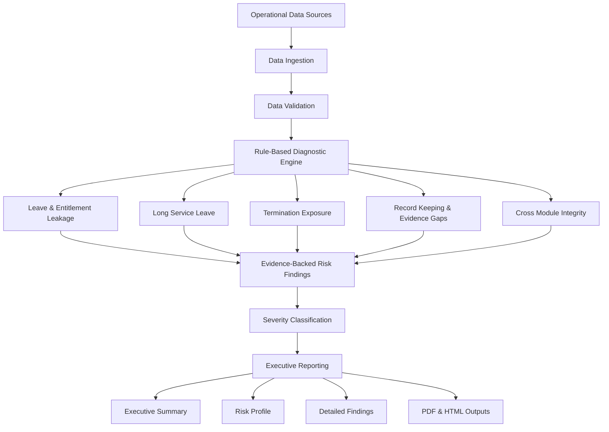

# Payroll Diagnostics Engine

Developed as part of the Chase Risk & Compliance (CRC) platform.

A modular operational diagnostics and governance platform designed to analyse business datasets, identify risk indicators, surface evidence gaps, detect operational inconsistencies, and generate executive-ready reporting.

CRC was built as an end-to-end diagnostics system demonstrating how structured analytics, rule-based reasoning, and evidence-backed reporting can be combined to improve operational visibility and governance outcomes.

Although demonstrated using payroll datasets, the underlying architecture was intentionally designed to support broader operational diagnostics and governance use cases.

---

# Platform Highlights

* 5 diagnostic domains
* Modular rule-based architecture
* Data ingestion and validation pipelines
* Evidence-backed findings generation
* Severity classification framework
* Executive reporting suite
* PDF and HTML report generation
* Client-isolated review architecture
* Governance-focused reporting outputs

---

# The Problem

Most operational systems are designed to process transactions and generate reports.

They are generally not designed to proactively identify:

* Hidden operational risks
* Data quality issues
* Process inconsistencies
* Evidence gaps
* Governance weaknesses
* Cross-system integrity failures
* Emerging risk patterns

As a result, issues often remain undetected until audits, investigations, employee disputes, acquisitions, or regulatory reviews occur.

---

# The Solution

CRC acts as an independent diagnostics layer that sits above operational datasets.

The platform ingests structured data, applies domain-specific rule analysis, generates evidence-backed findings, and produces executive-ready outputs that support operational review and governance activities.

The platform focuses on:

* Risk detection
* Operational assurance
* Data quality assessment
* Governance visibility
* Explainable findings
* Evidence traceability
* Executive reporting

Rather than replacing operational systems, CRC provides an additional layer of analytical review designed to identify issues that may otherwise remain hidden.

---

# Example Outputs

## Executive Summary

The platform generates executive-ready reporting designed to provide rapid visibility of key risk areas, severity distribution, and recommended review priorities.


---

## Module Risk Analysis

CRC analyses multiple governance domains independently and provides risk summaries for each module.


---

# System Architecture

The architecture below illustrates the end-to-end diagnostics workflow from ingestion through to executive reporting.



---

## Sample Executive Report

A sample executive report generated by the platform is included in this repository.

[View Sample Executive Report](docs/sample_reports/crc_executive_pack.pdf)

---

# Getting Started

## Clone Repository

```bash
git clone https://github.com/dcrops/chase-risk-compliance.git
cd chase-risk-compliance
```

## Create Virtual Environment

```bash
python -m venv .venv
```

## Install Dependencies

```bash
pip install -r requirements.txt
```

## Execute a Review

Run one of the example pilot reviews contained within the repository to generate findings and executive reports.

Review workspaces are located under:

```text
data/clients/
```

---

# Architecture Overview

CRC follows a layered architecture:

1. Data Ingestion
2. Data Validation
3. Diagnostic Analysis
4. Findings Generation
5. Executive Reporting

Each layer has a clearly defined responsibility, allowing the platform to remain modular, maintainable, and extensible.

Diagnostic runs are organised into isolated client review workspaces containing inputs, findings, outputs, and executive reports.

---

# Diagnostic Domains

## Leave & Entitlement Leakage (LEAVE)

Analyses leave balances, leave transactions, entitlement calculations, and reconciliation issues.

## Long Service Leave (LSL)

Reviews long service leave activity, exposure, balance integrity, and accrual-related risks.

## Termination Exposure (TERM)

Identifies termination-related evidence gaps, final pay risks, lifecycle inconsistencies, and process weaknesses.

## Record Keeping & Evidence Gaps (RKEG)

Evaluates supporting documentation, audit evidence, and governance controls.

## Cross-Module Integrity

Detects inconsistencies across related datasets and linked operational processes.

---

# Key Features

## Data Ingestion & Validation

* CSV-based ingestion framework
* Schema validation
* Coverage analysis
* Data quality assessment
* Missing field detection
* Readiness scoring

## Modular Rule Engine

* Configuration-driven diagnostics
* Domain-specific rule libraries
* Independent module execution
* Extensible architecture

## Findings Generation

* Evidence-backed findings
* Severity classification
* Traceable outputs
* Structured risk reporting

## Executive Reporting

* Executive summaries
* Risk profile reporting
* Detailed findings reports
* HTML outputs
* PDF outputs

---

# Key Engineering Concepts

CRC demonstrates several software engineering and analytics engineering patterns:

* Layered system architecture
* Modular rule engine design
* Configuration-driven diagnostics
* Data quality validation workflows
* Evidence-backed decision support
* Severity classification frameworks
* Cross-domain integrity analysis
* Executive reporting pipelines
* Reusable reporting components
* Client-isolated review workspaces

The project was intentionally structured to separate ingestion, validation, diagnostics, findings generation, and reporting into independently maintainable layers.

---

# Engineering Challenges Solved

This project demonstrates practical solutions for:

* Modular diagnostics architecture
* Rule-based analytical systems
* Explainable findings generation
* Structured evidence handling
* Governance-focused reporting
* Cross-domain integrity validation
* Operational intelligence workflows
* Executive-level communication

---

# Repository Structure

```text
src/
├── ingestion/
├── validation/
├── diagnostics/
├── findings/
├── reporting/
└── shared/

data/
└── clients/
    └── <client_name>/
        └── <review_name>/
            ├── inputs/
            ├── findings/
            ├── outputs/
            └── reports/

docs/
├── images/
└── sample_reports/

scripts/
templates/
tests/
```

---

# Client Review Structure

CRC is designed around isolated client review workspaces.

Each review contains its own:

* Input datasets
* Diagnostic findings
* Generated outputs
* Executive reports

This structure supports repeatable analysis, auditability, and separation of review artefacts.

---

# Technology Stack

## Core Technologies

* Python
* Pandas
* YAML

## Data Processing

* CSV ingestion pipelines
* Data validation frameworks
* Rule-based analytics

## Reporting

* Markdown generation
* HTML rendering
* PDF generation
* Executive reporting

## Engineering Practices

* Modular architecture
* Configuration-driven rules
* Evidence traceability
* Layered system design

## Testing & Tooling

* PyTest
* Git
* GitHub

---

# Public Repository Notice

This repository is a public-safe version of the Payroll Diagnostics Engine intended to demonstrate architecture, engineering approach, diagnostics workflows, and reporting capabilities.

Some domain-specific rule logic, thresholds, datasets, and implementation details have been simplified or removed.

No client data is included.

All datasets used within this repository are synthetic or demonstration-only.

---

# Portfolio

Portfolio Website:

https://journey.chaseriskandcompliance.com.au/

GitHub:

https://github.com/dcrops

---

# Why This Project

CRC reflects my approach to engineering:

* Start with a real-world business problem
* Design modular architectures
* Build explainable systems
* Focus on operational outcomes
* Produce actionable outputs
* Balance engineering with governance considerations

The project demonstrates software engineering, analytics engineering, operational intelligence, diagnostics, reporting, and governance-aware system design concepts that later informed the development of AI-powered operational intelligence platforms.
